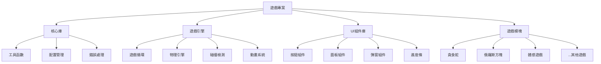

# HTML5 遊戲專案分析與改進建議

## 專案概覽
- **遊戲數量**: 13款HTML5遊戲
- **遊戲類型**: 小遊戲、互動遊戲、體感遊戲三大類
- **技術棧**: HTML5 Canvas + CSS + JavaScript (無外部依賴)
- **目標平台**: 桌面與移動設備

## 遊戲品質評估

### 優秀表現
1. **功能完整性**: 所有遊戲都有完整遊戲循環、計分系統、難度設定
2. **響應式設計**: 所有遊戲都支援移動設備，有適當的媒體查詢
3. **遊戲多樣性**: 涵蓋經典遊戲、益智遊戲、體感遊戲等多種類型
4. **本地存儲**: 多數遊戲支援本地存儲保存高分紀錄
5. **用戶體驗**: 一致的UI設計模式，清晰的遊戲說明

### 需要改進的方面
1. **代碼重複**: 各遊戲間有大量重複的基礎結構代碼
2. **性能優化**: 部分遊戲的遊戲循環效率有待提升
3. **錯誤處理**: 缺乏統一的錯誤處理機制
4. **可訪問性**: 鍵盤導航和屏幕閱讀器支援不足

## 技術問題識別

### 1. 性能問題
- **遊戲循環**: 部分遊戲使用`setInterval`而非`requestAnimationFrame`
- **內存洩漏**: 事件監聽器未正確清理
- **Canvas優化**: 未使用離屏Canvas進行預渲染

### 2. 代碼質量問題
- **全局變量**: 過多全局變量，缺乏模塊化
- **硬編碼**: 數值硬編碼，缺乏配置化
- **錯誤處理**: 缺乏try-catch塊和錯誤邊界處理

### 3. 瀏覽器兼容性
- **ES6特性**: 使用現代JavaScript特性，缺乏降級方案
- **API支援**: 體感遊戲依賴DeviceMotion API，缺乏備用方案
- **CSS網格**: 使用CSS Grid，舊瀏覽器支援有限

### 4. 移動設備問題
- **觸控延遲**: 部分遊戲的觸控響應有延遲
- **虛擬鍵盤**: 輸入框觸發虛擬鍵盤影響遊戲體驗
- **電池消耗**: 體感遊戲持續使用傳感器，電池消耗大

## UI/UX改進建議

### 1. 一致性改進
- **設計系統**: 建立統一的顏色、字體、間距規範
- **組件庫**: 創建可重用的UI組件（按鈕、面板、彈窗）
- **動畫規範**: 統一的過渡動畫和反饋效果

### 2. 可訪問性增強
- **ARIA標籤**: 為所有互動元素添加ARIA屬性
- **鍵盤導航**: 支援完整的鍵盤操作
- **對比度**: 確保文字與背景有足夠對比度
- **字體大小**: 支援字體縮放

### 3. 移動體驗優化
- **觸控目標**: 確保按鈕大小符合移動設備標準（最小44px）
- **手勢支援**: 添加滑動手勢控制
- **方向鎖定**: 遊戲時鎖定屏幕方向
- **狀態保存**: 遊戲暫停時保存狀態

### 4. 用戶引導改進
- **新手教學**: 添加互動式新手教學
- **進度指示**: 顯示遊戲進度和成就系統
- **幫助系統**: 上下文相關的幫助提示

## 功能增強建議

### 1. 社交功能
- **分數分享**: 支援分享分數到社交媒體
- **好友對比**: 與好友的分數對比
- **排行榜**: 全球/好友排行榜系統

### 2. 遊戲內容擴展
- **關卡編輯器**: 允許用戶創建自定義關卡
- **皮膚系統**: 可更換的遊戲主題和角色皮膚
- **成就系統**: 遊戲成就和解鎖內容

### 3. 多人遊戲
- **本地多人**: 同一設備上的多人遊戲
- **在線對戰**: 簡單的WebSocket多人對戰
- **合作模式**: 協作完成任務

### 4. 個性化設置
- **難度自定義**: 允許用戶自定義遊戲參數
- **控制方案**: 多種控制方案選擇
- **視覺選項**: 色盲模式、簡化效果等

## 性能優化建議

### 1. 加載優化
- **代碼分割**: 按需加載遊戲資源
- **資源預加載**: 預加載關鍵資源
- **緩存策略**: 合理的HTTP緩存策略

### 2. 渲染優化
- **Canvas分層**: 使用多個Canvas分層渲染
- **髒矩形**: 實現髒矩形渲染優化
- **WebGL**: 考慮使用WebGL進行2D渲染

### 3. 內存管理
- **對象池**: 使用對象池重用遊戲對象
- **資源釋放**: 遊戲結束時釋放未使用資源
- **垃圾回收**: 避免創建臨時對象

### 4. 網絡優化
- **CDN部署**: 使用CDN加速資源加載
- **壓縮傳輸**: 啟用Gzip/Brotli壓縮
- **離線支援**: 添加Service Worker支援離線遊玩

## 架構改進建議

### 1. 代碼組織

### 2. 構建流程
- **模塊打包**: 使用Webpack/Rollup進行模塊打包
- **代碼檢查**: 添加ESLint/Prettier代碼規範
- **自動測試**: 單元測試和集成測試
- **持續集成**: 自動化構建和部署

### 3. 部署策略
- **靜態託管**: 使用GitHub Pages/Vercel/Netlify
- **版本管理**: 語義化版本控制
- **A/B測試**: 新功能逐步發布

## 實施優先級

### 高優先級（立即實施）
1. 修復內存洩漏問題
2. 統一錯誤處理機制
3. 添加基本的可訪問性支援
4. 優化移動設備觸控體驗

### 中優先級（短期實施）
1. 創建共享代碼庫
2. 實現性能監控
3. 添加遊戲數據分析
4. 建立設計系統

### 低優先級（長期規劃）
1. 多人遊戲功能
2. 社交功能集成
3. 高級渲染優化
4. 跨平台應用打包

## 具體修改建議

### 遊戲1：貪食蛇
- **問題**: 使用`setInterval`而非`requestAnimationFrame`
- **建議**: 改用`requestAnimationFrame`實現平滑動畫
- **改進**: 添加觸控手勢控制（滑動方向）

### 遊戲2：Google恐龍
- **問題**: 缺乏暫停功能
- **建議**: 添加遊戲暫停和繼續功能
- **改進**: 優化障礙物生成算法

### 遊戲3：五子棋
- **問題**: AI響應時間固定
- **建議**: 根據難度調整AI思考時間
- **改進**: 添加悔棋功能

### 遊戲4：記憶配對
- **問題**: 卡片翻轉動畫不流暢
- **建議**: 使用CSS Transform優化動畫
- **改進**: 添加音效反饋

### 遊戲5：俄羅斯方塊
- **問題**: 缺乏預覽多個方塊功能
- **建議**: 添加下一個方塊預覽
- **改進**: 實現方塊保持功能

### 遊戲6：射擊遊戲
- **問題**: 敵人生成算法簡單
- **建議**: 實現波次系統和BOSS戰
- **改進**: 添加武器升級系統

### 遊戲7：大富翁
- **問題**: 遊戲節奏較慢
- **建議**: 添加快速模式選項
- **改進**: 實現AI難度梯度

### 遊戲8：合作逃離迷宮
- **問題**: 缺乏進度保存
- **建議**: 添加關卡進度保存
- **改進**: 實現更多謎題類型

### 遊戲9：舞蹈革命
- **問題**: 歌曲數量有限
- **建議**: 支援自定義歌曲導入
- **改進**: 添加舞蹈動作錄製

### 遊戲10：拳擊健身
- **問題**: 動作檢測精度不足
- **建議**: 改進動作識別算法
- **改進**: 添加訓練計劃功能

### 遊戲11：瑜伽冒險
- **問題**: 姿勢指導不夠詳細
- **建議**: 添加3D姿勢演示
- **改進**: 實現姿勢糾正功能

### 遊戲12：體感忍者
- **問題**: 攝像頭要求較高
- **建議**: 添加純鍵盤控制模式
- **改進**: 優化動作識別性能

### 遊戲13：體感運動
- **問題**: 缺乏運動數據導出
- **建議**: 添加運動數據導出功能
- **改進**: 實現個性化訓練計劃

## 監控與維護

### 1. 性能監控
- **FPS監控**: 實時顯示遊戲幀率
- **內存監控**: 檢測內存使用情況
- **加載時間**: 追蹤資源加載時間

### 2. 用戶分析
- **遊戲時長**: 統計各遊戲遊玩時間
- **完成率**: 追蹤關卡完成情況
- **錯誤報告**: 自動收集錯誤信息

### 3. 維護計劃
- **定期審查**: 每季度進行代碼審查
- **依賴更新**: 定期更新工具和庫
- **安全掃描**: 定期進行安全漏洞掃描

## 總結

這個HTML5遊戲專案展示了優秀的技術能力和創意，但在以下方面有改進空間：

1. **代碼質量**: 需要更好的組織和模塊化
2. **性能優化**: 特別是移動設備上的性能
3. **用戶體驗**: 增強可訪問性和移動體驗
4. **功能擴展**: 添加社交和多人遊戲功能

通過實施上述建議，可以將這個專案從一個優秀的技術演示提升為一個專業級的遊戲平台。